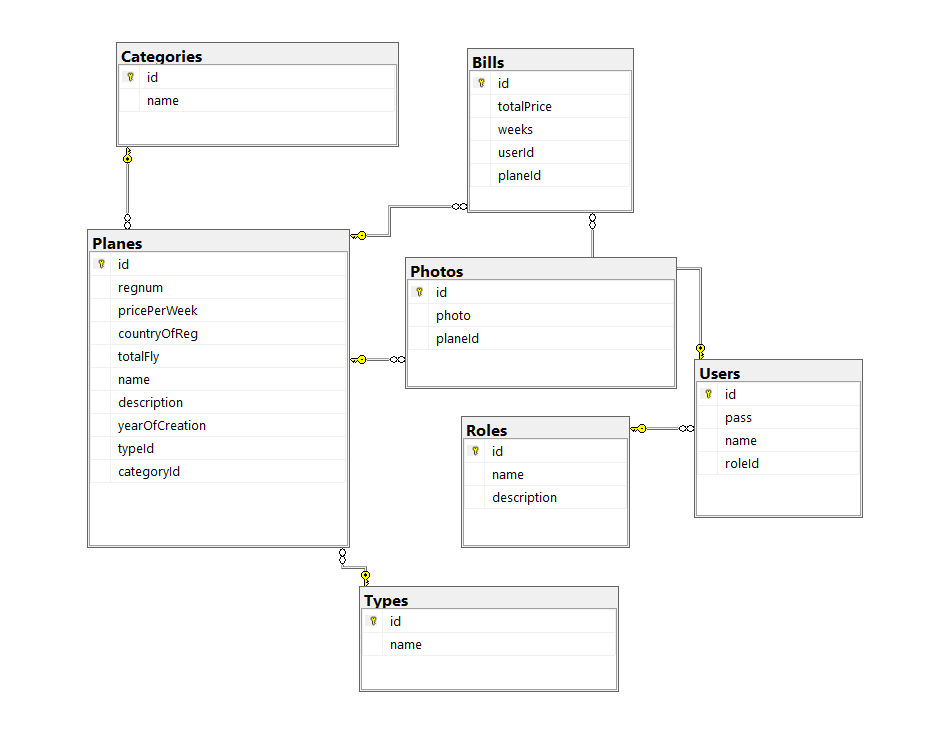
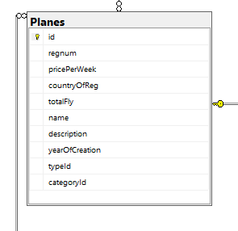
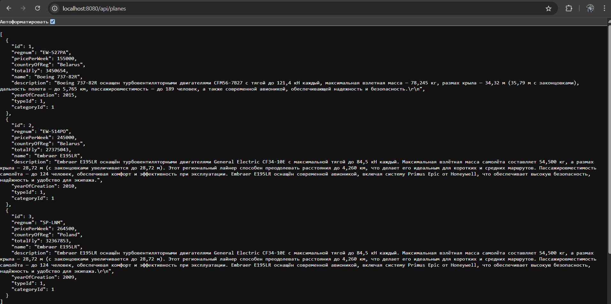
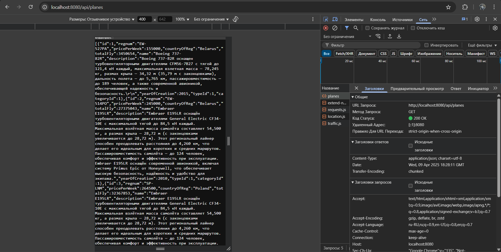
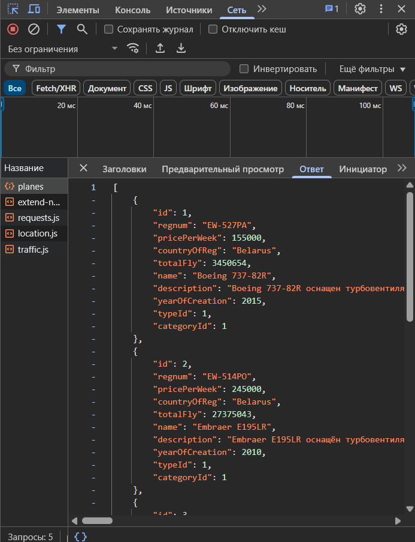

# JSON-API

**API-сервис на Go, который отдает JSON с актуальными данными о самолетах для аренды**

---

### диаграмма БД SSMS(SQL Server Management Studio)

### таблица Planes из БД SSMS

### пример API в браузере
 

### JSON запрос в браузере

---

**Условия использования:**

*Данный проект разрешается использовать и распространять только с указанием автора (CasualMan228 или ConusGames)*